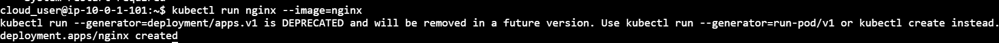

# Mastering Kubernetes Pod Configuration: Persistent Data

Create a Namespace for the resources you'll create in this lab step and change your default kubectl context to use the Namespace.

```
kubectl create namespace persistence
kubectl config set-context $(kubectl config current-context) --namespace=persistence
```

Create a PVC

#### pvc.yaml

```
kind: PersistentVolumeClaim
apiVersion: v1
metadata:
  name: db-data
spec:
  # Only one node can mount the volume in Read/Write
  # mode at a time
  accessModes:
  - ReadWriteOnce 
  resources:
    requests:
      storage: 2Gi
```

Create pod from pvc.yaml

```
kubectl create -f pvc.yaml
```

You will use the PVC to store data in a database, a common example of persistent data that should survive in case a Pod were to be terminated. Use get to display the PVC.

```
kubectl get pvc
```

<figure><figcaption></figcaption></figure>

pvc is a kubectl alias for persistentvolumeclaim, so you don't need to type the complete Resource name. The output shows the PVC STATUS is Bound, but the output may show Pending while the underlying PV is being created. The STORAGECLASS is gp2 which is the type of automatically configured Amazon EBS volumes that are created. Use get to display the underlying PV.

```
kubectl get pv
```

<figure><figcaption></figcaption></figure>


&#x20;
