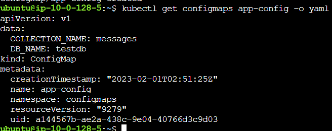

# Building a Kubernetes 1.27 Cluster with kubeadm

## Install Packages

### **Control Pane Node**

**Create the configuration file for containerd:**

```
cat << EOF | sudo tee /etc/modules-load.d/containerd.conf 
overlay 
br_netfilter 
EOF
```

<figure><figcaption></figcaption></figure>

**Load the modules:**

```
sudo modprobe overlay 
sudo modprobe br_netfilter
```

**Set the system configurations for Kubernetes networking:**

```
cat <<EOF | sudo tee /etc/sysctl.d/99-kubernetes-cri.conf 
net.bridge.bridge-nf-call-iptables = 1 
net.ipv4.ip_forward = 1 
net.bridge.bridge-nf-call-ip6tables = 1 
EOF
```

<figure><figcaption></figcaption></figure>

**Apply the new settings:**

```
sudo sysctl --system
```

**Install containerd:**

```
sudo apt-get update && sudo apt-get install -y containerd.io
```

**Create the default configuration file for containerd:**

```
sudo mkdir -p /etc/containerd
```

**Generate the default containerd configuration, and save it to the newly created default file:**

```
sudo containerd config default | sudo tee /etc/containerd/config.toml
```

**Restart containerd to ensure the new configuration file is used:**

```
sudo systemctl restart containerd
```

**Verify that containerd is running:**

```
sudo systemctl status containerd
```

<figure><figcaption></figcaption></figure>

**Disable swap:**

```
sudo swapoff -a
```

**Install the dependency packages:**

```
sudo apt-get update && sudo apt-get install -y apt-transport-https curl
```

**Download and add the GPG key:**

```
curl -s https://packages.cloud.google.com/apt/doc/apt-key.gpg | sudo apt-key add -
```

**Add Kubernetes to the repository list:**

```
cat <<EOF | sudo tee /etc/apt/sources.list.d/kubernetes.list 
deb https://apt.kubernetes.io/ kubernetes-xenial main 
EOF
```

**Update the package listings:**

```
sudo apt-get update
```

**Install Kubernetes packages:**

> **Note:** If you get a `dpkg lock` message, just wait a minute or two before trying the command again.

```
sudo apt-get install -y kubelet=1.27.0-00 kubeadm=1.27.0-00 kubectl=1.27.0-00
```

**Turn off automatic updates:**

```
sudo apt-mark hold kubelet kubeadm kubectl
```

<figure><figcaption></figcaption></figure>

### Worker Node

**Create the configuration file for containerd:**

```
cat << EOF | sudo tee /etc/modules-load.d/containerd.conf 
overlay 
br_netfilter 
EOF
```

<figure><figcaption></figcaption></figure>

**Load the modules:**

```
sudo modprobe overlay 
sudo modprobe br_netfilter
```

**Set the system configurations for Kubernetes networking:**

```
cat <<EOF | sudo tee /etc/sysctl.d/99-kubernetes-cri.conf
net.bridge.bridge-nf-call-iptables = 1
net.ipv4.ip_forward = 1
net.bridge.bridge-nf-call-ip6tables = 1
EOF
```

**Apply the new settings:**

```
sudo sysctl --system
```

**Install containerd:**

```
sudo apt-get update && sudo apt-get install -y containerd.io
```

**Create the default configuration file for containerd:**

```
sudo mkdir -p /etc/containerd
```

**Generate the default containerd configuration, and save it to the newly created default file:**

```
sudo containerd config default | sudo tee /etc/containerd/config.toml
```

**Restart containerd to ensure the new configuration file is used:**

```
sudo systemctl restart containerd
```

**Verify that containerd is running:**

```
sudo systemctl status containerd
```

<figure><figcaption></figcaption></figure>

**Disable swap:**

```
sudo swapoff -a
```

**Install the dependency packages:**

```
sudo apt-get update && sudo apt-get install -y apt-transport-https curl
```

**Download and add the GPG key:**

```
curl -s https://packages.cloud.google.com/apt/doc/apt-key.gpg | sudo apt-key add -
```

**Add Kubernetes to the repository list:**

```
cat <<EOF | sudo tee /etc/apt/sources.list.d/kubernetes.list 
deb https://apt.kubernetes.io/ kubernetes-xenial main 
EOF
```

**Update the package listings:**

```
sudo apt-get update
```

**Install Kubernetes packages:**

> **Note:** If you get a `dpkg lock` message, just wait a minute or two before trying the command again.

```
sudo apt-get install -y kubelet=1.27.0-00 kubeadm=1.27.0-00 kubectl=1.27.0-00
```

**Turn off automatic updates:**

```
sudo apt-mark hold kubelet kubeadm kubectl
```

<figure><figcaption></figcaption></figure>

## Initialize the Cluster

### **Control Pane Node**

**Initialize the Kubernetes cluster on the control plane node using `kubeadm`:**

```
sudo kubeadm init --pod-network-cidr 192.168.0.0/16 --kubernetes-version 1.27.0
```

**Set `kubectl` access:**

```
mkdir -p $HOME/.kube 
sudo cp -i /etc/kubernetes/admin.conf $HOME/.kube/config 
sudo chown $(id -u):$(id -g) $HOME/.kube/config
```

**Test access to the cluster:**

```
kubectl get nodes
```

<figure><figcaption></figcaption></figure>

## Install the Calico Network Add-On

### **Control Pane Node**

**On the control plane node, install Calico Networking:**

```
kubectl apply -f https://raw.githubusercontent.com/projectcalico/calico/v3.25.0/manifests/calico.yaml
```

**Check the status of the control plane node:**

```
kubectl get nodes
```

<figure><figcaption></figcaption></figure>

## Join the Worker Nodes to the Cluster

### **Control Pane Node**

**In the control plane node, create the token and copy the `kubeadm join` command:**

```
kubeadm token create --print-join-command
```

<figure><figcaption></figcaption></figure>

### Worker Node

**You can just copy the output from the previous command on the Control Pane Node but add sudo first and it will look similar to this:**

```
kubeadm join 10.0.1.101:6443 --token $token  --discovery-token-ca-cert-hash $discovery-token-ca-cert-hash
```

**In both worker nodes, paste the full `kubeadm join` command to join the cluster. Use `sudo` to run it as root:**

```
sudo kubeadm join
```

### **Control Pane Node**

In the control plane node, view the cluster status:

```
kubectl get nodes
```

<figure><figcaption></figcaption></figure>


